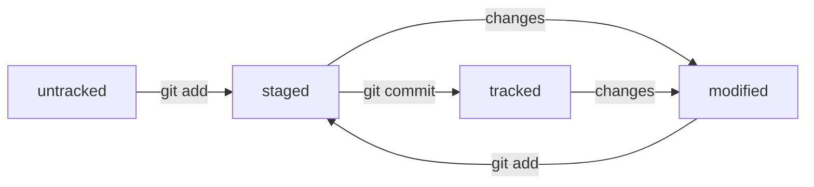

# Git Cheat Sheet
## Git configuration
> **git config --global user.name "Your Name"** - Set the name that will be attached to your commits and tags.

> **git config --global user.email "you@example.com"** - Set the e-mail address that will be attached to your commits and tags.

> **git config --global color.ui auto** - Enable some colorization of Git output.

## Starting a project

> **git init [project name]** - Create a new local repository in the current directory. If **[project name]** is provided, Git will create a new directory named **[project name]** and will initialize a repository inside it.

> **git clone <project url>** - Downloads a project with the entire history from the remote repository.                                                                                                                         |

## Day-to-day work

> **git status** - Displays the status of your working directory. Options include new, staged, and modified files. It will retrieve branch name, current commit identifier, and changes pending commit.

> **git add [file]** - Add a file to the **staging area**. Use. in place of the full file path to add all changed files from the **current directory down** into the **directory tree**.

> **git commit** - Create a new commit from changes added to the **staging area**. The **commit** must have a message!

## Inspect history

> **git log [-n count]** - List commit history of current branch. **-n count** limits list to last **n** commits.

## Hash, Log and HEAD

> **Хеш** — это идентификатор коммита, его можно посмотреть используя команду git log
> 
> **Хеширование** (от англ. hash, «рубить», «крошить», «мешанина») — это способ преобразовать набор данных и получить их «отпечаток» (англ. fingerprint).
> 
> Файл **HEAD** (англ. «голова», «головной») — один из служебных файлов папки .git. Он указывает на коммит, который сделан последним (то есть на самый новый).

## Git статусы
> **untracked** (англ. «неотслеживаемый»)
Новые файлы в Git-репозитории помечаются как untracked, то есть неотслеживаемые. Git «видит», что такой файл существует, но не следит за изменениями в нём. У untracked-файла нет предыдущих версий, зафиксированных в коммитах или через команду git add.
> 
> **staged** (англ. «подготовленный»)
После выполнения команды git add файл попадает в staging area (от англ. stage — «сцена», «этап [процесса]» и area — «область»), то есть в список файлов, которые войдут в коммит. В этот момент файл находится в состоянии staged.
> 
> **tracked** (англ. «отслеживаемый»)
Состояние tracked — это противоположность untracked. Оно довольно широкое по смыслу: в него попадают файлы, которые уже были зафиксированы с помощью git commit, а также файлы, которые были добавлены в staging area командой git add. То есть все файлы, в которых Git так или иначе отслеживает изменения.
> 
>**modified** (англ. «изменённый»)
>Состояние modified значит, что Git сравнил содержимое файла с последней сохранённой версией и нашёл отличия. Например, файл был закоммичен и после этого изменён. 

## Жизненный цикл файлов в git
